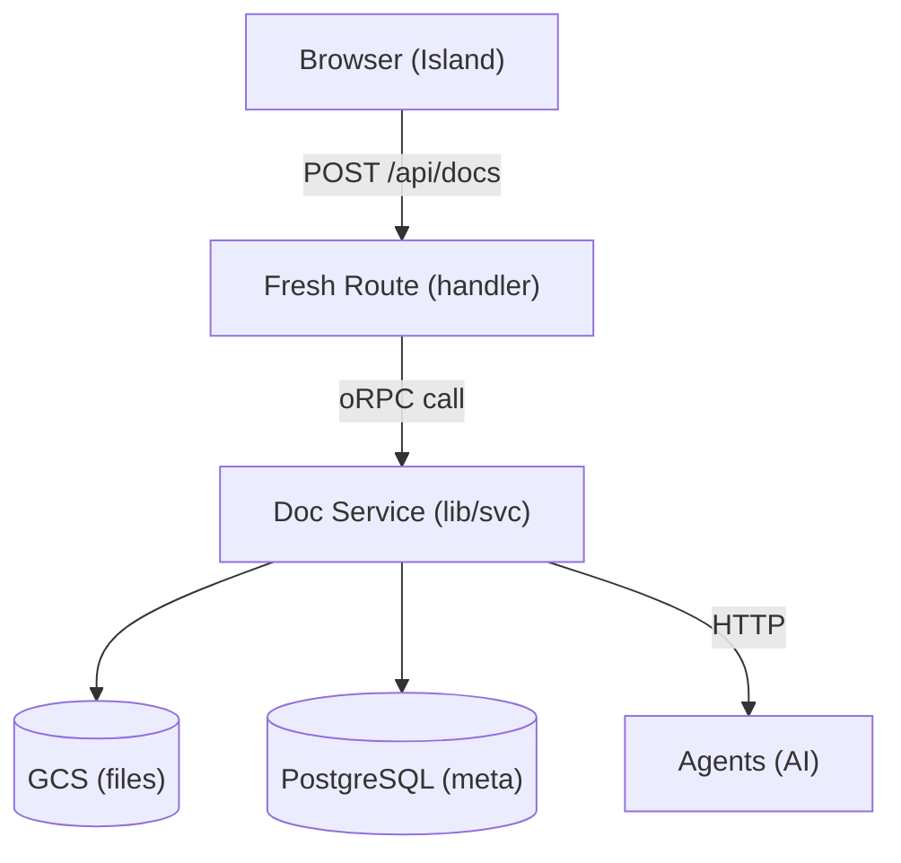

# Architecture Diagram

Create clear architecture diagrams showing how the specified components
connect and interact within the system.

## Steps

1. **Determine the output format** from `$ARGUMENTS`:
   - If the user mentions "mermaid", use **Mermaid** format
   - Otherwise, default to **ASCII** format

2. **Identify the scope** from `$ARGUMENTS`. This could be:
   - Specific components (e.g. "doc processing and workflows")
   - A full service (e.g. "redcrayon backend")
   - Cross-service flows (e.g. "redcrayon to agents")
   - The entire system overview

3. **Research the components** - Read key files to understand:
   - What each component does
   - How components communicate (HTTP, oRPC, database, message queue)
   - Data flow direction
   - External service dependencies

4. **Draw the diagram(s)** in the chosen format.

   ### ASCII Format

   **Boxes for components:**
   ```
   ┌─────────────┐
   │  Component   │
   │  (details)   │
   └─────────────┘
   ```

   **Arrows for data/control flow:**
   ```
   ──────►  one-way flow
   ◄──────► bidirectional
   - - - ► async/event-based
   ```

   **Grouping for services/layers:**
   ```
   ╔══════════════════════╗
   ║   Service Name       ║
   ║  ┌────┐  ┌────┐     ║
   ║  │ A  │──│ B  │     ║
   ║  └────┘  └────┘     ║
   ╚══════════════════════╝
   ```

   ### Mermaid Format

   Use fenced code blocks with `mermaid` language identifier. Choose the
   most appropriate diagram type:

   - `graph TD` or `graph LR` — for system overviews and data flow
   - `sequenceDiagram` — for interaction sequences between components
   - `flowchart` — for pipelines and decision flows

   **Conventions:**
   - Use `subgraph` blocks to group related components by service/layer
   - Label all edges with what flows through them
   - Use arrow styles to distinguish sync vs async:
     - `-->` for synchronous calls
     - `-.->` for async/event-based flows
   - Use shape syntax to distinguish component types:
     - `[Component]` for services/processes
     - `[(Database)]` for data stores
     - `([Queue])` for message queues
     - `{{External}}` for external services

5. **Provide multiple views when useful:**
   - **System Overview** - High-level boxes showing services and their connections
   - **Data Flow** - How data moves through the pipeline
   - **Sequence** - Step-by-step interaction order for key flows
   - **Layer Diagram** - UI → API → Service → Database stack

6. **Annotate the diagram** - Below each diagram, add a brief legend and
   notes explaining:
   - What each component is responsible for
   - Key protocols or patterns used at each boundary
   - Where state is stored

7. **Call out the key files** - Map diagram components to actual file paths so
   the user can navigate directly to the code.

## Style

- Keep diagrams readable - prefer multiple simple diagrams over one cluttered one
- Label all arrows with what flows through them
- Use consistent box/node sizes within a diagram
- Include the tech stack in component labels when relevant
  (e.g. "Fresh 2.0", "FastAPI", "PostgreSQL")
- **ASCII-specific:** Max width ~80 characters for terminal readability
- **Mermaid-specific:** Keep node IDs short but labels descriptive

## Example Output: ASCII

```
System: Document Processing Pipeline

┌──────────┐    POST /api/docs    ┌──────────────┐
│  Browser  │────────────────────►│  Fresh Route  │
│  (Island) │                     │  (handler)    │
└──────────┘                     └──────┬───────┘
                                        │
                                   oRPC call
                                        │
                                        ▼
                                 ┌──────────────┐
                                 │  Doc Service  │
                                 │  (lib/svc)    │
                                 └──────┬───────┘
                                        │
                              ┌─────────┼─────────┐
                              ▼         ▼         ▼
                         ┌────────┐ ┌────────┐ ┌────────┐
                         │  GCS   │ │Postgres│ │ Agents │
                         │(files) │ │ (meta) │ │  (AI)  │
                         └────────┘ └────────┘ └────────┘

Legend:
  ─────► Synchronous call
  - - -► Async/background
```

## Example Output: Mermaid


